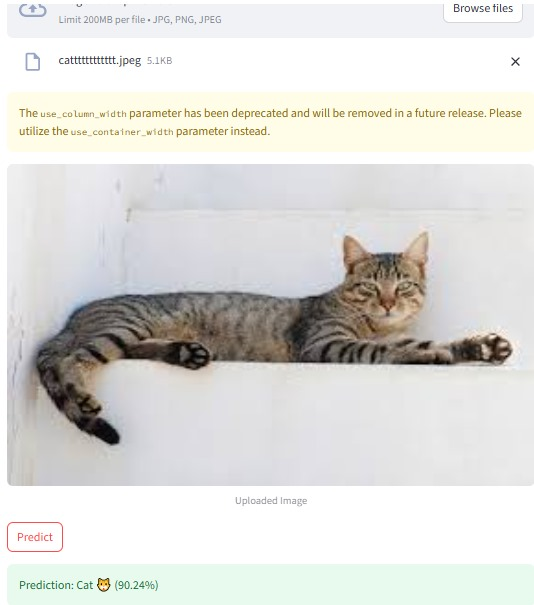
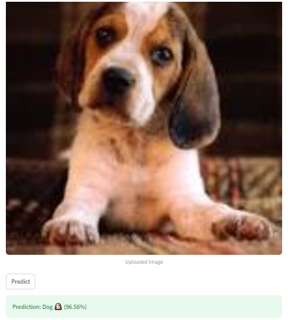
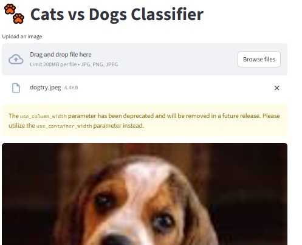

# 🐶🐱 Cats vs Dogs Classifier

A powerful deep learning-based image classifier that distinguishes between cats and dogs with **80% accuracy**, built using **TensorFlow**, served with a **Django REST Framework backend**, and presented via a **Streamlit frontend**.

## 🚀 Overview

This project leverages a custom-trained Convolutional Neural Network (CNN) to classify pet images into two categories: **Cat** or **Dog**. The backend is powered by a Django REST API that handles image prediction, and the frontend is built with Streamlit for a clean, interactive user experience.

- 🔍 Dataset: [Dog and Cat Classification Dataset – Kaggle](https://www.kaggle.com/datasets/bhavikjikadara/dog-and-cat-classification-dataset)
- 📈 Accuracy: Achieved **80% validation accuracy**
- 🧠 Model: CNN with **Batch Normalization**, **Dropout**, and **Adam optimizer**
- 📦 Deployment-ready: Can be hosted on platforms like Render, Hugging Face, or locally.

---

## 🧠 Model Architecture

The CNN model is built using **TensorFlow/Keras**:

Input Image (150x150x3)
        │
        ▼
Conv2D(32, 3x3, relu, same) ──► BatchNorm ──► MaxPooling(2x2) ──► Dropout(0.05)
        │
        ▼
Conv2D(64, 3x3, relu, same) ──► BatchNorm ──► MaxPooling(2x2) ──► Dropout(0.05)
        │
        ▼
Conv2D(128, 3x3, relu, same) ──► BatchNorm ──► MaxPooling(2x2) ──► Dropout(0.20)
        │
        ▼
Flatten
        │
        ▼
Dense(512, relu) ──► Dropout(0.25)
        │
        ▼
Dense(1, sigmoid)
        │
        ▼
Predicted Class (Cat or Dog)

## Sample

